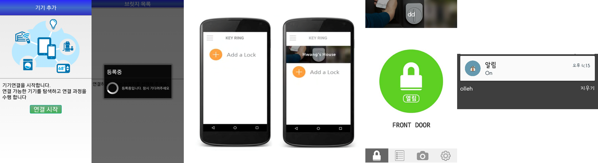

# Portfolio

Github : https://github.com/Mason-htj

## 보유기술

- 언어
	- Java
	- C
	- C++
	- JavaScript
	- Python
	- C#
	- Node.js
- 소프트웨어
	- Git
	- MySQL
	- MongoDB
	- Android Studio
	- Slack

## 활동

부스트캠프 2기 안드로이드 과정

- 기간 : 2017-07-03 ~ 2017-08-28
- 내용
	- 학습 프로젝트 3주(안드로이드 기본)
	- 실무 프로젝트 5주(회식이)
	- 기술 세미나(Kotlin, Library, Firebase...)

## 수상

### 인천대학교 컴퓨터공학부 졸업작품 발표대회

금상 2017-06-02 인천대학교 정보기술대학

# 프로젝트

## 개인

### [회식이](docs/회식이.md)

회식자리를 원하는 고객과 손님을 원하는 사장님의 매칭 앱

- 기간 : 2017-08-07 ~ 2017-08-28
- 사용기술 : Android, Express, MongoDB, FCM, GoogleMaps
- Github : [https://github.com/Mason-htj/StaffDinner](https://github.com/Honest-Hong/StaffDinner)

### 나의 버킷 리스트

간단한 버킷 리스트 관리 앱

- 기간 : 2016-01-01 ~
- 사용기술 : Android
- PlayStore : [https://play.google.com/store/apps/details?id=com.honestgoods.mybucketlist](https://play.google.com/store/apps/details?id=com.honestgoods.mybucketlist)

## 팀 / 회사

### [썰록](docs/썰록.md)

음성인식을 통하여 회의를 진행하고 인식 결과를 바탕으로 문서로 받아볼 수 있는 앱

- 소속 : 인천대학교 컴퓨터공학부 - 썰록팀
- 기간 : 2016-09 ~ 2017-06
- 역할 : Android 앱 개발
- 사용기술 : Android, Express, MySQL, FCM, KoNLPy
- Github : [https://github.com/Mason-htj/Project-SNLU](https://github.com/Mason-htj/Project-SNLU)

### [Play in Seoul - 피서](docs/피서.md)

서울에 있는 관광 명소들을 추천하고 기록으로 남길 수 있는 앱

- 소속 : 서울시 앱 공모전 - 피서팀
- 기간 : 2016-08 ~ 2016-10
- 역할 : Android 앱 개발, 서버 개발
- 사용기술 : Android, Express, MySQL

### [저전력 스마트 도어락](docs/도어락.md)

블루투스를 활용한 스마트 도어락. 라즈베리파이와 블루투스로 연결되어있는 도어락을 스마트폰 앱으로 제어를 한다.

- 소속 : 인천대학교 정보기술대학 무선 네트워크 연구실(Winlab)
- 기간 : 2016-02 ~ 2016-09
- 역할 : Android 앱 개발, 서버 개발
- 사용기술 : Android, GCM, Bluetooth, PHP

### [토익 한다면 한다](docs/토한다.md)

토익을 공부하기 위한 스케줄러 및 경쟁 커뮤니티

- 소속 : 토한다
- 기간 : 2016-10 ~ 2016-12
- 역할 : Android 앱 개발, 서버 개발
- 사용기술 : Android, MySQL, JSP

